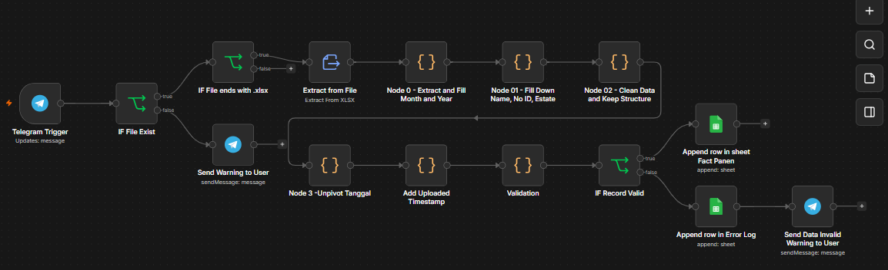
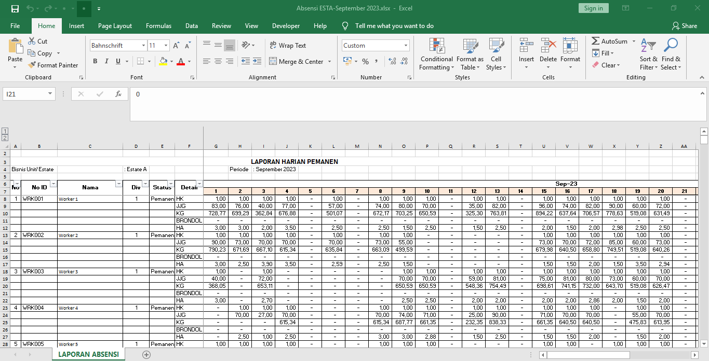
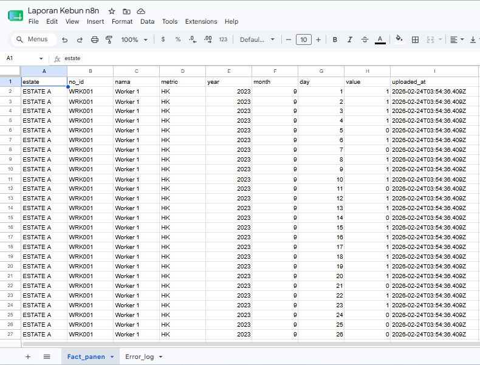
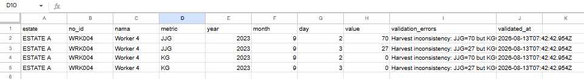

# Operational Spreadsheet ETL Pipeline

> Transforming human-oriented operational spreadsheets into trusted, analytics-ready datasets through automated validation, normalization, and business-rule driven ETL.

| Project | Details |
|----------|---------|
| **Business Domain** | Plantation Operations |
| **Project Type** | Operational Spreadsheet ETL Pipeline |
| **Primary Capability** | ETL, Data Quality & Data Standardization |
| **Data Source** | Operational Excel Reports |
| **Architecture** | ETL |
| **Automation** | n8n Workflow |
| **Status** | ✅ Completed |

---

# Overview

Operational reporting spreadsheets are typically designed for human readability rather than machine processing. While convenient for daily operations, these spreadsheets often contain merged cells, repeated values, multi-level headers, and inconsistent structures that make automated processing difficult.

This project demonstrates how operational Excel reports can be transformed into trusted, analytics-ready datasets through a repeatable ETL process. The solution focuses on improving data quality, enforcing business rules, and preparing standardized datasets for downstream reporting and database ingestion.

An extended version of this project also demonstrates how the same ETL process can be fully automated using **n8n**, reducing repetitive manual work and improving operational efficiency.

---

# Business Problem

Operational data collected from field activities is commonly maintained in Excel spreadsheets optimized for manual reporting rather than analytics.

Typical challenges include:

- Merged cells used for reporting periods
- Dates stored as column headers instead of row values
- Multiple measurement types within a single table
- Blank cells representing repeated values
- Placeholder symbols for missing information
- Manual data entry inconsistencies
- Dataset structures unsuitable for database ingestion

These layouts are easy for humans to read but difficult for automated processing, validation, aggregation, and reporting.

---

# Solution

This project implements a repeatable ETL workflow that transforms operational spreadsheets into standardized datasets suitable for analytics.

The pipeline automatically:

- Separates metadata from transactional records
- Cleans inconsistent values and placeholder symbols
- Normalizes spreadsheet layouts into tabular structures
- Converts wide-format reports into row-based datasets
- Applies business-rule validation
- Flags invalid records for operational review
- Produces analytics-ready datasets for downstream reporting

The same transformation logic has also been implemented as an automated **n8n workflow**, enabling spreadsheet ingestion, validation, error reporting, and dataset generation with minimal manual intervention.

---

# ETL Workflow

```text
Operational Excel Report
            │
            ▼
Extract
(Read spreadsheet)
            │
            ▼
Normalize
(Fill Down, Clean Values)
            │
            ▼
Transform
(Unpivot & Standardize)
            │
            ▼
Business Rule Validation
            │
      ┌─────┴─────┐
      ▼           ▼
Valid Data   Exception Records
      │           │
      ▼           ▼
Fact Dataset  Error Log
      │
      ▼
Analytics / Database
```

---

# Engineering Decisions

## Why Normalize Spreadsheet Structures?

Operational spreadsheets are optimized for manual reporting, not database storage. Normalization ensures each row represents one business event while each column represents a single attribute.

---

## Why Unpivot?

Operational reports commonly store dates as columns. Analytical systems require dates as row values, making unpivoting essential for aggregation and filtering.

---

## Why Explicit Measurement Units?

Different operational metrics (e.g., harvest count and weight) should never share the same column without context. Explicit units eliminate ambiguity and improve downstream analysis.

---

## Why Validate Before Loading?

Incorrect operational records should not silently enter analytical datasets. Validation ensures data quality while separating problematic records for manual review.

---

## Why Generate an Error Log?

Instead of discarding invalid records, the pipeline isolates them into an Error Log for operational clarification, preserving data integrity while supporting continuous process improvement.

---

# Data Quality

The ETL process applies multiple validation rules before producing the final dataset.

Current validation includes:

- Placeholder value normalization
- Blank value handling
- Data completeness checks
- Measurement consistency
- Required field validation
- Structural validation after transformation

Records failing validation are routed to an Error Log instead of being silently corrected or removed.

---

# Business Rules

Examples of operational business rules include:

- Harvest quantity should not exist without its corresponding measurement.
- Placeholder symbols are converted into standardized missing values.
- Every measurement must have an explicit unit.
- Every output row represents one observation.
- Duplicate structural information is standardized before loading.

These rules help ensure downstream reports are based on trusted and consistent data.

---

# Automation Workflow

The ETL logic has been extended into an automated workflow using **n8n**.

The automation performs:

- Spreadsheet ingestion
- Data transformation
- Validation
- Error logging
- Dataset generation
- Telegram notification

This demonstrates how operational ETL processes can evolve into production-ready workflow automation.




---

# Input vs Output

## Raw Operational Spreadsheet



Typical characteristics:

- Human-readable layout
- Multi-level headers
- Merged cells
- Mixed measurement types
- Manual formatting

---

## Standardized Dataset



The resulting dataset:

- One row = one observation
- Database-ready
- Analytics-ready
- Easy to aggregate
- Easy to validate

---

## Exception Handling




Records failing validation are isolated for manual review rather than being discarded.

This approach preserves data integrity while allowing operational teams to investigate reporting issues.

---

# Engineering Highlights

- Designed a repeatable ETL workflow for operational spreadsheets
- Applied normalization techniques including Fill Down and Unpivot
- Implemented business-rule driven validation
- Generated structured fact tables suitable for database ingestion
- Separated invalid records into an Error Log for operational review
- Extended the ETL process into a fully automated n8n workflow

---

# Tech Stack

| Component | Technology |
|------------|------------|
| Manual Transformation | Power Query (M) |
| Workflow Automation | n8n |
| Automated Transformation | Javascript (n8n Code Nodes) |
| Data Storage | Google Sheets |
| Notifications | Telegram |
| Output | Normalized Fact Dataset & Error Log |

---

# Future Improvements

Potential enhancements include:

- Loading standardized datasets into a cloud data warehouse
- Automated scheduling and monitoring
- Incremental processing
- Additional business-rule validation
- Interactive operational dashboard
- Integration with BI platforms

---

# Key Takeaway

Operational spreadsheets are designed for people.

Data engineering transforms them into datasets that systems can trust.

Reliable analytics begins with reliable data.
