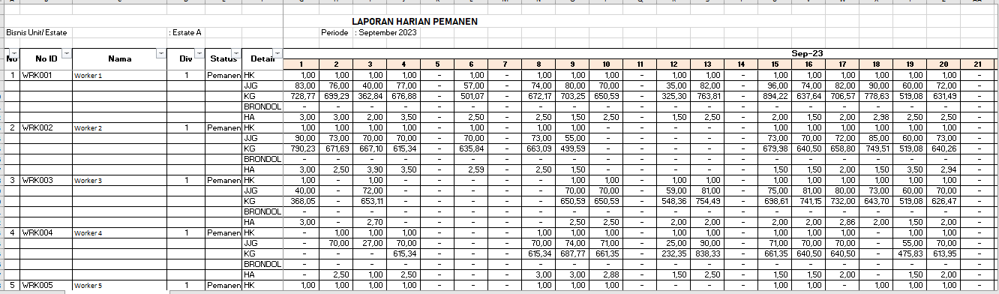
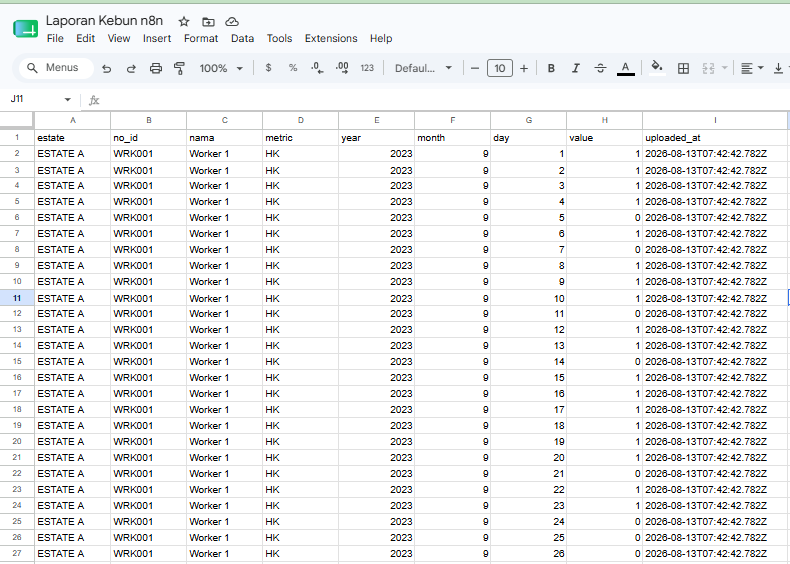
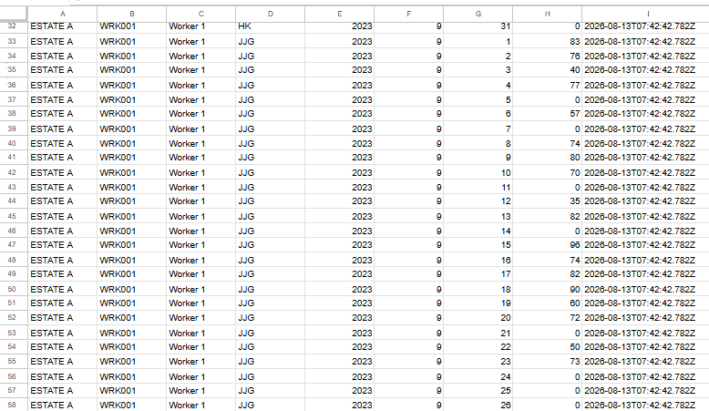
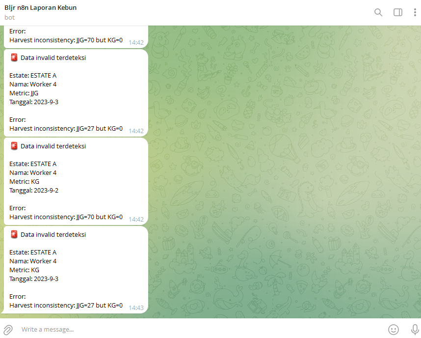

# Operational Spreadsheet ETL Pipeline

Transforming human-readable operational spreadsheets into a normalized, validated, and repeatable dataset using Power Query, n8n, and JavaScript.

## Project Overview

| | |
|---|---|
| **Business Problem** | Operational Excel reports were designed for human readability, making the data difficult to process consistently for reporting and downstream use. |
| **Solution** | Prototype the transformation logic in Power Query, then automate ingestion, normalization, validation, error routing, and notification using n8n and JavaScript. |
| **Input** | Operational Excel spreadsheet with dates as columns, metrics as rows, repeated employee information, and inconsistent values. |
| **Output** | Normalized Fact dataset, Error Log for invalid records, and Telegram notification for detected anomalies. |
| **Key Focus** | Schema normalization, data quality, business-rule validation, and repeatable ETL automation. |

---

## Business Problem

Operational data was submitted through Excel files designed primarily for human readability rather than machine processing.

The source files contained structures such as:

- Dates stored horizontally as columns (1–31)
- Operational metrics stored as rows
- Employee information that required fill-down
- Mixed data types and placeholder values
- Multiple metrics within the same report structure
- Data inconsistencies that could not be detected through datatype validation alone

This format worked for operational users, but made the data difficult to process consistently for reporting and downstream analysis.

The objective was to convert the spreadsheet into a standardized row-level dataset while introducing repeatable transformation, validation, and error handling.

---

## Solution

The solution was developed in two stages.

### 1. Transformation Proof of Concept — Power Query

Power Query was first used to explore the spreadsheet structure and validate the transformation approach.

The prototype focused on:

- Cleaning the spreadsheet structure
- Filling down employee information
- Converting horizontal date columns into rows using Unpivot
- Standardizing metric and value fields
- Producing a normalized tabular dataset

This provided a quick way to validate the transformation logic before automating the process.

### 2. Automated ETL Workflow — n8n + JavaScript

Once the transformation pattern was established, the process was automated using n8n and custom JavaScript.

The automated workflow handles:

- Excel file ingestion through Telegram
- Spreadsheet extraction
- Reporting period extraction
- Data cleaning and normalization
- Unpivot transformation
- Basic data validation
- Business-rule validation
- Valid and invalid record routing
- Fact and Error Log outputs
- Telegram notification for detected anomalies

---

## Pipeline Architecture

```text
Telegram Upload
      ↓
Excel Extraction
      ↓
Extract Reporting Period
      ↓
Fill Down Employee Data
      ↓
Clean & Standardize Structure
      ↓
Unpivot Date Columns
      ↓
Add Processing Timestamp
      ↓
Basic Validation
      ↓
Business Rule Validation
      ↓
Is Record Valid?
   ↙             ↘
Valid           Invalid
  ↓                ↓
Fact Dataset     Error Log
                   ↓
             Telegram Alert
```
---

## Workflow Screenshots

### 1. Automated ETL Workflow

The n8n workflow orchestrates the complete process from Telegram file ingestion through transformation, validation, output routing, and notification.


### 2. Source Spreadsheet

Example of the original operational spreadsheet designed for human readability, with dates represented as columns and operational metrics represented as rows.



### 3. Normalized Fact Dataset

Valid records are transformed into a normalized row-level structure and written to the Fact dataset.




### 4. Data Quality Error Handling

Records that fail technical or business-rule validation are routed to the Error Log with the validation reason preserved for investigation.


### 5. Automated Telegram Alert

Detected data-quality issues can trigger an automated Telegram notification, allowing operational users to identify problematic records without manually reviewing the entire dataset.


---

## Data Transformation

The original spreadsheet was structured for operational readability.

Example:

| Employee | Metric | 1 | 2 | 3 | ... |
|---|---|---:|---:|---:|---|
| Worker A | JJG | 70 | 65 | 80 | ... |
| Worker A | KG | 900 | 0 | 1050 | ... |

Dates were represented as columns while operational metrics were represented as rows.

The pipeline converts this structure into normalized records:

| Employee | Year | Month | Day | Metric | Value |
|---|---:|---:|---:|---|---:|
| Worker A | 2024 | 9 | 1 | JJG | 70 |
| Worker A | 2024 | 9 | 1 | KG | 900 |
| Worker A | 2024 | 9 | 2 | JJG | 65 |
| Worker A | 2024 | 9 | 2 | KG | 0 |

Each row represents **one operational metric for one employee on one date**.

This structure is easier to validate, query, aggregate, and consume by downstream processes.

Zero values are intentionally preserved because `0` can carry business meaning and may be required for downstream validation.

---

## Data Quality & Validation

The pipeline separates validation into two layers:

### Basic Validation

Generic data-quality checks are applied to each normalized record.

Current checks include:

- Required fields must be present
- Metric values must be numeric
- Negative values are rejected
- Year, month, and day must form a valid calendar date

Records that fail these checks are marked as invalid.

### Business Rule Validation

Business validation evaluates relationships between operational metrics rather than validating individual values only.

An example business rule implemented in this project is:

```text
JJG > 0 AND KG = 0
→ Flag as operational anomaly
```

Example:

```text
Employee : Worker A
Date     : 2024-09-02
JJG      : 65
KG       : 0
```

Both values are technically valid numbers.

However, a positive harvest count (`JJG`) with zero recorded weight (`KG`) represents an operational inconsistency and should be reviewed.

The related records are therefore marked as invalid and routed to the Error Log.

Business validation is intentionally separated from basic validation because these rules are domain-specific and may change according to operational requirements.

---

## Error Handling

Validation does not stop the entire pipeline when problematic records are detected.

Each record receives an `is_valid` status:

```text
is_valid = true
→ Fact Dataset

is_valid = false
→ Error Log
→ Telegram Alert
```

This allows valid records to continue through the pipeline while invalid records are isolated for investigation.

The Error Log stores the problematic record together with its validation reason, making anomalies easier to trace and review.

---

## Output

### Fact Dataset

Valid records are written into a normalized Fact dataset.

Example fields:

| Field | Description |
|---|---|
| `estate` | Operational estate/source |
| `no_id` | Employee identifier |
| `nama` | Employee name |
| `year` | Reporting year |
| `month` | Reporting month |
| `day` | Operational day |
| `metric` | Operational metric |
| `value` | Metric value |
| `uploaded_at` | Processing/upload timestamp |

### Error Log

Invalid records are stored separately together with validation information such as:

- Original record values
- Validation status
- Validation error
- Validation timestamp

This keeps problematic records visible without contaminating the clean Fact dataset.

---

## Tech Stack

| Technology | Purpose |
|---|---|
| **Power Query** | Initial transformation proof of concept |
| **n8n** | Workflow orchestration and automation |
| **JavaScript** | Custom transformation and validation logic |
| **Google Sheets** | Fact dataset and Error Log storage |
| **Telegram Bot** | File ingestion and anomaly notification |

---

## Key Engineering Decisions

### 1. Human-Readable Data ≠ Machine-Ready Data

The original spreadsheet was designed for operational users.

Instead of forcing downstream processes to repeatedly interpret the original layout, the pipeline converts the data into a standardized row-level structure.

### 2. Prototype Before Automating

Power Query was used to quickly explore the spreadsheet and validate the transformation logic.

Once the normalization pattern was understood, the process was implemented as an automated workflow using n8n and JavaScript.

### 3. Preserve Zero Values

Zero values are not automatically discarded.

A value of `0` is different from a missing record and may contain important business information.

For example:

```text
JJG = 70
KG  = 0
```

Without preserving the zero value, this operational inconsistency could not be detected by downstream business validation.

### 4. Separate Technical and Business Validation

Basic validation handles generic data-quality requirements.

Business validation handles domain-specific relationships between records.

This separation makes the workflow easier to maintain because business rules can evolve independently from the core technical validation logic.

### 5. Use Infrastructure Appropriate to the Workload

The workflow processes relatively small operational spreadsheet files.

n8n provides sufficient orchestration, branching, integration, and notification capabilities for this workload without introducing unnecessary infrastructure complexity.

The objective is to solve the data problem reliably rather than introduce additional tools only for technical complexity.

---

## Repository Structure

```text
operational-spreadsheet-etl/
│
├── README.md
│
├── workflow/
│   └── operational-spreadsheet-etl.json
│
├── sample_data/
│   └── sample_input.xlsx
│
└── screenshots/
    ├── workflow.png
    ├── fact_output.png
    └── error_log.png
```

> Sample data contains anonymized or synthetic operational records only.

---

## Key Takeaways

This project demonstrates how a spreadsheet designed for human readability can be transformed into a repeatable data workflow.

The project focuses on:

- Schema normalization
- ETL automation
- Data quality validation
- Domain-specific business validation
- Error isolation
- Workflow orchestration
- Automated notification

The key lesson from the project is:

> **Data that is technically valid is not necessarily operationally valid.**

A reliable data pipeline needs to handle both.
